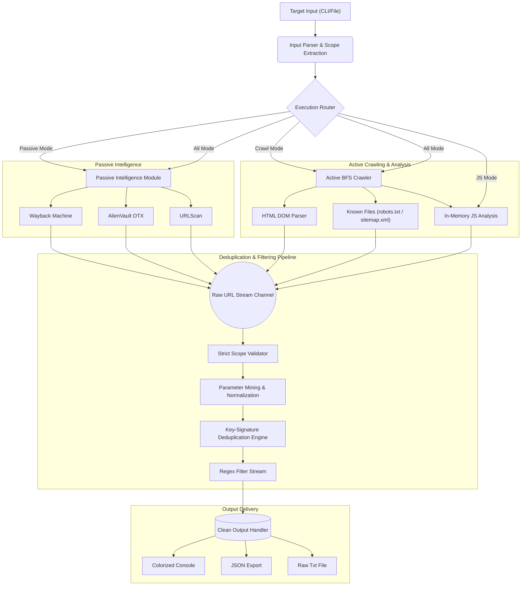

# urlreeper

```text
██╗   ██╗██████╗ ██╗     ██████╗ ███████╗███████╗██████╗ ███████╗██████╗ 
██║   ██║██╔══██╗██║     ██╔══██╗██╔════╝██╔════╝██╔══██╗██╔════╝██╔══██╗
██║   ██║██████╔╝██║     ██████╔╝█████╗  █████╗  ██████╔╝█████╗  ██████╔╝
██║   ██║██╔══██╗██║     ██╔══██╗██╔══╝  ██╔══╝  ██╔═══╝ ██╔══╝  ██╔══██╗
╚██████╔╝██║  ██║███████╗██║  ██║███████╗███████╗██║     ███████╗██║  ██║
 ╚═════╝ ╚═╝  ╚═╝╚══════╝╚═╝  ╚═╝╚══════╝╚══════╝╚═╝     ╚══════╝╚═╝  ╚═╝

                      v1.0.0 | By @whoami_404
             https://github.com/youwannahackme
```

[](https://opensource.org/licenses/MIT)
[](https://go.dev/)
[](#)

`urlreeper` is an advanced, high-performance web reconnaissance and endpoint discovery framework written in Go. Designed for security researchers, penetration testers, and bug bounty hunters, it automates the collection, cleaning, and active crawling of web assets in a highly concurrent, deadlock-free pipeline.

---

## Key Features

- 🚀 **High-Speed Concurrency:** Powered by Go's native goroutines and channels, enabling massive parallel processing with a minimal memory footprint.
- 🔗 **Unified Recon Pipeline:** Seamlessly chains passive intelligence gathering and active web crawling in a single, automated execution flow.
- 🌐 **Multi-Source Passive Gathering:** Concurrently queries threat intelligence platforms and web archives (Wayback Machine, AlienVault OTX, and URLScan) to reconstruct a target's historical footprint.
- 🧲 **Intelligent Parameter Mining:** Extracts URLs containing query parameters, normalizes them, replaces parameter values with a customizable placeholder (e.g., `FUZZ`), and deduplicates them using parameter-key signatures.
- 🕷️ **Deadlock-Free Active Crawling:** Features a concurrent breadth-first search (BFS) crawler optimized with non-blocking background queueing to handle large-scale domains without resource exhaustion.
- 🤖 **Automated Known Files Parsing:** Automatically fetches and parses `robots.txt` and `sitemap.xml` in real-time, extracting disallowed paths and sitemap URLs to feed back into the crawl queue.
- 📜 **In-Memory JavaScript Analysis:** Downloads and scans discovered JavaScript files on the fly using highly optimized regular expressions to extract deep, hidden API endpoints.
- 🎯 **Regex Stream Filtering:** Filters discovered endpoints in real-time using custom regular expressions or pattern files.
- 📦 **Zero-Dependency Binary:** Compiles into a single, self-contained executable. No external runtimes (like Python or Node.js) or browser installations (like Chrome) are required.

---



---

## Installation

### Prerequisites
- [Go 1.20 or higher](https://go.dev/dl/)

### Using go install
Ensure your `$GOPATH/bin` (or `%USERPROFILE%\go\bin` on Windows) is added to your system's `PATH` environment variable:
```bash
go install -v github.com/youwannahackme/urlreeper@latest
```

### Build from Source
```bash
git clone https://github.com/youwannahackme/urlreeper.git
cd urlreeper
go build -o urlreeper.exe main.go
```

---

## Quick Start

### 1. Full Recon (Default Mode)
Gather all passive URLs (including subdomains) and actively crawl them concurrently:
```bash
.\urlreeper.exe target.com
```

### 2. Parameter Mining for Fuzzing
Fetch passive URLs, isolate those with query parameters, replace values with `FUZZ`, deduplicate them, and save the clean URLs to a file:
```bash
.\urlreeper.exe target.com -mode passive -params-only -o fuzz_targets.txt
```

### 3. JavaScript Endpoint Extraction
Extract hidden endpoints from a remote JavaScript file:
```bash
.\urlreeper.exe -mode js -u https://target.com/assets/main.js
```
Or analyze a local JavaScript file:
```bash
.\urlreeper.exe -mode js -file .\local_script.js
```

### 4. Custom Regex Filtering
Only output endpoints containing `/api/v2/` or ending in `.json`:
```bash
.\urlreeper.exe target.com -mr "/api/v2/,\.json$"
```

---

## Comparison with Traditional Tools

`urlreeper` was built to solve the limitations of running multiple fragmented tools during the reconnaissance phase:

| Feature / Metric | `urlreeper` | Traditional Parameter Miners | Traditional JS Parsers | Traditional Web Crawlers |
| :--- | :---: | :---: | :---: | :---: |
| **Language** | **Go** | Python | Python | Go / Python |
| **Active Crawling** | **Yes** | No | No | Yes |
| **Passive Gathering** | **Yes** | Yes | No | No |
| **JS Endpoint Extraction** | **Yes** | No | Yes | No |
| **Deduplication by Keys** | **Yes** | Yes | No | No |
| **External Dependencies** | **None** | Many (Python packages) | Many | Many (e.g., Headless Chrome) |
| **Pipeline Integration** | **Unified** | Single-purpose | Single-purpose | Single-purpose |
| **Execution Speed** | **Extreme** | Slow | Slow | Moderate |

---

## CLI Options

### Target Options
- `-u, -list <string>`: Target URL or file path containing a list of target URLs.
- `-domain <string>`: Target domain for passive gathering (automatically extracted if not specified).
- `-file <string>`: Local JavaScript file path to analyze.

### Scan Options
- `-mode <string>`: Execution mode: `all` (default), `crawl` (active only), `passive` (passive only), `js` (JS analysis only).
- `-d <int>`: Maximum crawl depth (default `2`).
- `-inside`: Restrict active crawling to paths inside the initial URL path.
- `-jc, -js-crawl`: Enable endpoint extraction from discovered JS files (default `true`).
- `-H <value>`: Custom header in `Name: Value` format (can be specified multiple times).

### Passive Options
- `-placeholder <string>`: Parameter value placeholder (default `"FUZZ"`).
- `-params-only`: Only output URLs containing query parameters.

### Filter Options
- `-mr, -match-regex <string>`: Regex pattern or comma-separated list of patterns to match on output URLs.

### Performance Options
- `-t <int>`: Number of concurrent threads/workers (default `20`).
- `-timeout <int>`: HTTP request timeout in seconds (default `10`).
- `-proxy <string>`: HTTP/SOCKS5 proxy URL (e.g., `http://127.0.0.1:8080`).
- `-insecure`: Skip TLS certificate verification.

### Output Options
- `-o, -output <string>`: File path to save results (saves clean, raw URLs only).
- `-json`: Output results in JSON format.
- `-verbose`: Enable verbose output (includes source tags and crawl depth in terminal).
- `-no-color`: Disable color output in the terminal.
- `-silent`: Suppress the ASCII banner and status messages.
- `-version`: Display version and exit.

---

## Security & Ethical Use Policy

> [!IMPORTANT]
> This tool is designed **strictly for authorized security testing, penetration testing, and educational purposes**. 
> The author (`@whoami_404`) does not condone, support, or encourage unauthorized scanning or hacking. Always obtain explicit permission from the target owner before performing any scans. The user is solely responsible for compliance with local and international laws.

---

## License
Released under the [MIT License](LICENSE). Developed and maintained by [@whoami_404](https://github.com/youwannahackme).
