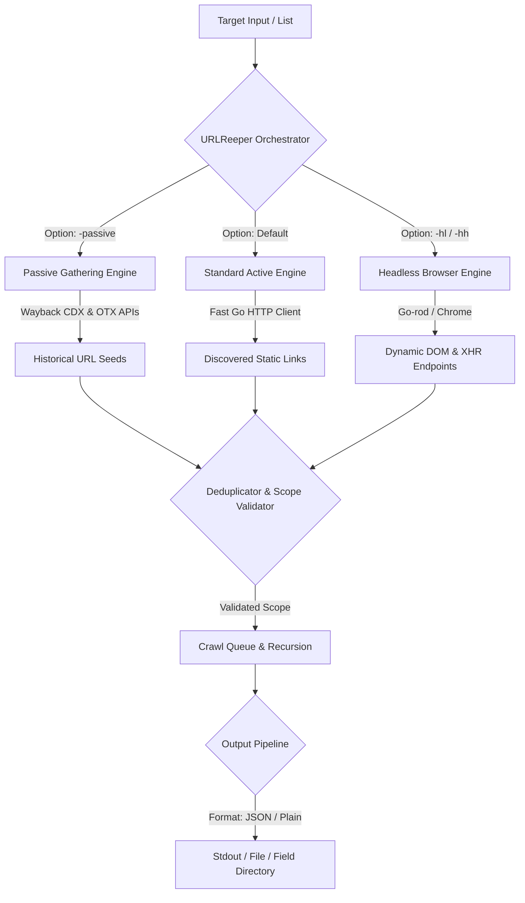

# URLREEPER

```text
██╗   ██╗██████╗ ██╗     ██████╗ ███████╗███████╗██████╗ ███████╗██████╗ 
██║   ██║██╔══██╗██║     ██╔══██╗██╔════╝██╔════╝██╔══██╗██╔════╝██╔══██╗
██║   ██║██████╔╝██║     ██████╔╝█████╗  █████╗  ██████╔╝█████╗  ██████╔╝
██║   ██║██╔══██╗██║     ██╔══██╗██╔══╝  ██╔══╝  ██╔═══╝ ██╔══╝  ██╔══██╗
╚██████╔╝██║  ██║███████╗██║  ██║███████╗███████╗██║     ███████╗██║  ██║
 ╚═════╝ ╚═╝  ╚═╝╚══════╝╚═╝  ╚═╝╚══════╝╚══════╝╚═╝     ╚══════╝╚═╝  ╚═╝
```

**URLReeper** is a next-generation hybrid active and passive web crawling and spidering framework designed for security reconnaissance and automation pipelines. It combines passive web archive discovery with blazing-fast HTTP request crawling and full Chromium-based headless browser rendering.

Developed by **whoami_404** • GitHub: [github.com/youwannahackme/urlreeper](https://github.com/youwannahackme/urlreeper)

---

## 🚀 Engine Architecture

URLReeper is built with a highly concurrent, modular architecture in Go. It operates a hybrid crawler engine that integrates active and passive discovery channels into a single unified queue.



### 1. Passive Discovery Engine
Leverages historical archives to map out a target's endpoints without interacting directly with the target host.
*   **Wayback Machine:** Queries the Wayback CDX Server API to harvest cached paths.
*   **AlienVault OTX:** Fetches indexed URL lists for the domain.
*   **Pipeline Seeding:** Discovered URLs are validated against scope limits and fed back into the active crawl queue to serve as starting points for recursive discovery.

### 2. Standard Active Engine
Optimized for high-concurrency, low-latency crawling of traditional static HTML pages.
*   Uses a size-controlled WaitGroup and cookie jar.
*   Parses links, anchors, script tags, and forms using GoQuery HTML parsing.
*   Features path-similarity deduplication (using a Path Trie) to automatically collapse similar paths (e.g. merging `/user/123` and `/user/456`).

### 3. Headless Browser Engine
Utilizes [go-rod](https://github.com/go-rod/rod) to drive a Chromium browser instance.
*   **Dynamic SPAs:** Fully renders Single Page Applications (built on React, Angular, Vue, etc.) to capture client-side elements.
*   **XHR/Fetch Extraction:** Intercepts browser network requests to identify API endpoints dynamically queried post-load.
*   **DOM Interaction:** Triggers form extractions, captchas, and dynamic elements.

---

## ✨ Features

*   **Hybrid Gathering:** Combine passive archive scraping with active web crawling.
*   **Scope Control:** Fine-grained inclusions/exclusions using regex and domain patterns.
*   **JS Extraction:** Deep parsing of endpoints inside Javascript files using AST-based parsing via `jsluice`.
*   **Automatic Form Filling:** Dynamically fills out form elements.
*   **Deduplication:** Smart URL deduplication and path-similarity detection.
*   **Highly Configurable Output:** Standard text formatting or custom JSONL fields.

---

## 🛠️ Installation

URLReeper requires **Go 1.26+** to build successfully.

### From Source (Recommended)

```bash
# Clone the repository
git clone https://github.com/youwannahackme/urlreeper.git
cd urlreeper

# Install the binary
go install -v ./cmd/urlreeper
```

This will build and install the `urlreeper` binary to your `$GOPATH/bin` directory. Alternatively, you can build a local binary using:

```bash
go build -o urlreeper ./cmd/urlreeper
```

### Direct Installation

You can also install directly via `go install`:

```bash
go install -v github.com/youwannahackme/urlreeper/cmd/urlreeper@latest
```

> [!NOTE]
> If direct installation returns a module path mismatch warning, please use the clone-and-install method above.

---

## 📖 CLI Usage

```text
URLReeper is a fast crawler focused on execution in automation
pipelines offering both headless and non-headless crawling.

Usage:
  ./urlreeper [flags]

Flags:
INPUT:
   -u, -list string[]     target url / list to crawl
   -passive, -ps          enable passive URL discovery from web archives (Wayback Machine, AlienVault OTX)
   -resume string         resume scan using resume.cfg
   -e, -exclude string[]  exclude host matching specified filter ('cdn', 'private-ips', cidr, ip, regex)

CONFIGURATION:
   -r, -resolvers string[]       list of custom resolver (file or comma separated)
   -d, -depth int                maximum depth to crawl (default 3)
   -jc, -js-crawl                enable endpoint parsing / crawling in javascript file
   -jsl, -jsluice                enable jsluice parsing in javascript file (memory intensive)
   -ct, -crawl-duration value    maximum duration to crawl the target for (s, m, h, d) (default s)
   -kf, -known-files string      enable crawling of known files (all,robotstxt,sitemapxml)
   -mrs, -max-response-size int  maximum response size to read (default 4194304)
   -timeout int                  time to wait for request in seconds (default 10)
   -aff, -automatic-form-fill    enable automatic form filling (experimental)
   -fx, -form-extraction         extract form, input, textarea & select elements in jsonl output
   -retry int                    number of times to retry the request (default 1)
   -proxy string                 http/socks5 proxy to use
   -td, -tech-detect             enable technology detection
   -H, -headers string[]         custom header/cookie to include in all HTTP requests
   -s, -strategy string          Visit strategy (depth-first, breadth-first) (default "depth-first")
   -iqp, -ignore-query-params    Ignore crawling same path with different query-param values
   -fsu, -filter-similar         filter crawling of similar looking URLs
   -fst, -filter-similar-threshold int  number of distinct values before a path position is treated as parameter (default 10)

HEADLESS:
   -hl, -headless                    enable headless crawling
   -hh, -hybrid                      enable headless hybrid crawling (experimental)
   -sc, -system-chrome               use local installed chrome browser instead of urlreeper installed
   -sb, -show-browser                show the browser on the screen with headless mode
   -nos, -no-sandbox                 start headless chrome in --no-sandbox mode
   -cdd, -chrome-data-dir string     path to store chrome browser data
   -scp, -system-chrome-path string  use specified chrome browser for headless crawling
   -xhr, -xhr-extraction             extract xhr request url,method in jsonl output

FILTER:
   -mr, -match-regex string[]             regex or list of regex to match on output url
   -fr, -filter-regex string[]            regex or list of regex to filter on output url
   -em, -extension-match string[]         match output for given extension (eg, -em php,html,js)
   -ef, -extension-filter string[]        filter output for given extension (eg, -ef png,css)
   -duf, -disable-unique-filter           disable duplicate content filtering
```

### Quick Examples

*   **Passive-Only Exploration:**
    ```bash
    ./urlreeper -u tesla.com -passive -depth 1
    ```
*   **Standard Active Crawl:**
    ```bash
    ./urlreeper -u https://example.com -depth 3
    ```
*   **Headless Crawling (SPAs & AJAX):**
    ```bash
    ./urlreeper -u https://example.com -headless -xhr
    ```
*   **Piping Targets from stdin:**
    ```bash
    cat domains.txt | ./urlreeper -passive -depth 2 -json -o output.jsonl
    ```

---

## 📄 License

This project is licensed under the MIT License. See [LICENSE.md](file:///c:/Users/whoami/Desktop/urlreeper/LICENSE.md) for details.
